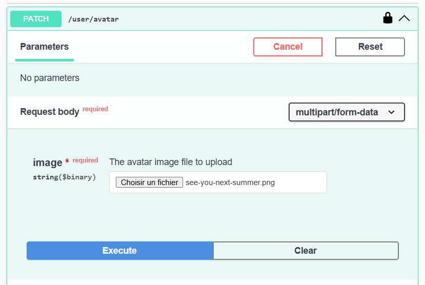

# L'upload d'image

Dans cet exemple, nous allons voir comment uploader une image pour l'avatar du user.

L'upload d'image dans une application NestJS peut être réalisé en utilisant le package `nestjs-form-data` pour gérer les formulaires multipart/form-data et `sharp` pour le traitement des images. Voici comment procéder.

_🔎Note: il existe différente manière de gérer l'upload d'image notament via `Multer` mais personnelement, je trouve plus simple via cette manière._

## Modofication du modèle User

Nous allons modifier le modèle `User` pour ajouter un champ pour l'avatar. Ce champ sera de type `string` pour stocker le chemin de l'image.

(fichier: `src\entities\user.entity.ts`)

```typescript
import { UserRole } from 'src/shared/enums/user-role.enum';
import { Column, Entity, PrimaryGeneratedColumn } from 'typeorm';

@Entity({ name: 'user' })
export class UserEntity {
  @PrimaryGeneratedColumn('uuid')
  id: string;

  @Column({ length: 100, unique: true })
  username: string;

  @Column()
  password: string;

  @Column()
  firstname: string;

  @Column({ default: UserRole.Client })
  role: UserRole;

  // (NEW) Ajout du champ avatar
  @Column({ nullable: true })
  avatar: string; // url vers l'image de l'utilisateur (stockée sur le serveur)
}
```

Par défaut ce champ sera `null`, ce qui signifie que l'utilisateur n'a pas d'avatar.

## Installation des dépendances

Pour l'upload d'image, nous avons besoin de 2 packages:

- `nestjs-form-data` pour gérer les formulaires multipart/form-data
- `sharp` pour le traitement des images

```bash
npm install nestjs-form-data sharp
```

## Configuration du module

Dans le module principal (`app.module.ts`), nous devons importer le module `FormDataModule` de `nestjs-form-data` :

```typescript
import { MiddlewareConsumer, Module } from '@nestjs/common';
import { TodoController } from './controllers/todo.controller';
// (... autres imports)
import { NestjsFormDataModule } from 'nestjs-form-data'; // (NEW) 1. Importation du module

@Module({
  imports: [
    // import des .env
    ConfigModule.forRoot({ envFilePath: ['.env.dev', '.env'] }),
    // configuration pour le token JWT
    JwtModule.register({
      secret: process.env.JWT_SECRET,
      signOptions: { expiresIn: '1d' },
    }),
    // (... autres imports)
    NestjsFormDataModule, // (NEW) 2. Ajout du module dans les imports
  ],
  controllers: [TodoController, AuthController, UserController],
  providers: [TodoService, UserService],
})
export class AppModule {
  configure(consumer: MiddlewareConsumer) {
    consumer.apply(LoggingMiddleware).forRoutes('*');
    consumer.apply(AuthMiddleware).forRoutes('*');

    // '*' pour tous les routes, ou ['route1', 'route2']
  }
}
```

## Création du DTO pour l'upload d'image

Nous allons créer un DTO (Data Transfer Object) pour gérer l'upload d'image. Ce DTO contiendra le fichier image et éventuellement d'autres champs si nécessaire.

Pour l'exemple, nous allons créer un DTO `UploadAvatarDto` qui contiendra le fichier image à uploader.

(fichier: `src\dtos\user.form.dto.ts`)

```typescript
import { ApiProperty } from '@nestjs/swagger';
import { HasMimeType, IsFile, MaxFileSize, MemoryStoredFile } from 'nestjs-form-data';

export class UploadAvatarDto {
  @ApiProperty({
    description: 'The avatar image file to upload',
    required: true,
    type: 'string',
    format: 'binary',
  })
  @IsFile()
  @MaxFileSize(5 * 1024 * 1024) // 5 MB
  @HasMimeType(['image/jpeg', 'image/png', 'image/gif'])
  image: MemoryStoredFile;
}
```

Explication:

- `@IsFile()`: Indique que le champ est un fichier.
- `@MaxFileSize(5 * 1024 * 1024)`: Limite la taille du fichier à 5 Mo.
- `@HasMimeType(['image/jpeg', 'image/png', 'image/gif'])`: Limite les types MIME acceptés aux images JPEG, PNG et GIF.
- `MemoryStoredFile`: Utilisé pour stocker le fichier en mémoire.

⚠️ Note: Vous pouvez ajuster les types MIME et la taille maximale selon vos besoins.
⚠️ Note2: Attention que le fichier est stocké en mémoire, donc si vous avez des fichiers volumineux, cela peut causer des problèmes de performance. Pour des fichiers plus volumineux, envisagez de les stocker sur le disque ou dans un service de stockage externe comme AWS S3.

## Création du contrôleur pour l'upload d'image

Nous allons créer un contrôleur pour gérer l'upload de l'avatar. Ce contrôleur contiendra une méthode pour uploader l'image et mettre à jour le profil de l'utilisateur.

(fichier: `src\controllers\user.controller.ts` - `nest g controller controllers/user`)

```typescript
import { Body, Controller, Patch, Req, UseGuards } from '@nestjs/common';
import { ApiBearerAuth, ApiConsumes } from '@nestjs/swagger';
import { FormDataRequest } from 'nestjs-form-data';
import { UploadAvatarDto } from 'src/dtos/user.form.dto';
import { ConnectedGuard } from 'src/guards/connected.guard';
import { UserService } from 'src/services/user.service';
import { Session } from 'src/shared/interfaces/session.interface';

@Controller('user')
export class UserController {
  constructor(private readonly userService: UserService) {}

  @Patch('avatar')
  @ApiConsumes('multipart/form-data')
  @ApiBearerAuth()
  @UseGuards(ConnectedGuard)
  @FormDataRequest()
  async updateAvatar(
    @Req() req: Request & { session: Session },
    @Body() updateAvatarDto: UploadAvatarDto,
  ) {
    await this.userService.updateAvatar(req.session.id, updateAvatarDto.image); // la méthode updateAvatar doit être implémentée dans le service UserService
  }
}
```

Explication:

- `@Patch('avatar')`: Définit la route pour l'upload de l'avatar.
- `@ApiConsumes('multipart/form-data')`: Indique à **Swagger** que cette route consomme des données de type `multipart/form-data`.
- `@FormDataRequest()`: Indique que cette méthode gère les requêtes de type `multipart/form-data`.
- `@UseGuards(ConnectedGuard)`: Protège la route avec le garde `ConnectedGuard` pour s'assurer que l'utilisateur est connecté.
- `@Req() req: Request & { session: Session }`: Récupère la requête et la session de l'utilisateur connecté. (pour accèder à l'ID de l'utilisateur)
- `@Body() updateAvatarDto: UploadAvatarDto`: Récupère les données du formulaire, y compris le fichier image.
- `await this.userService.updateAvatar(req.session.id, updateAvatarDto.image)`: Appelle la méthode `updateAvatar` du service `UserService` pour mettre à jour l'avatar de l'utilisateur.

## Implémentation de la méthode `updateAvatar` dans le service UserService

(fichier: `src\services\user.service.ts`)

```typescript
import { Injectable } from '@nestjs/common';
// (... autres imports)

// Nouveaux imports utiliser pour l'upload d'image
import * as sharp from 'sharp';
import { MemoryStoredFile } from 'nestjs-form-data';
import * as fs from 'fs';
import * as path from 'path';

@Injectable()
export class UserService {
  constructor(
    @InjectRepository(UserEntity)
    private readonly userRepository: Repository<UserEntity>,
  ) {}

  // (... autre méthodes)

  // NEW
  async updateAvatar(userId: string, avatarFile: MemoryStoredFile): Promise<boolean> {
    const user = await this.userRepository.findOne({ where: { id: userId } });
    if (!user) {
      throw new Error('User not found');
    }

    // Converssion de l'image en format WebP et redimensionnement (par exemple, 200x200 pixels)
    const processedImage = await sharp(avatarFile.buffer)
      .resize(200, 200) // taille de l'image
      .webp({ quality: 50 }) // convertit en format WebP avec une qualité de 50%
      .toBuffer();

    // Définir le chemin où l'image sera enregistrée
    const filePath = `public/images/avatars/${userId}.webp`;
    const absolutePath = path.resolve(__dirname, '..', '..', filePath);

    // Vérification et création du répertoire si nécessaire
    await fs.promises.mkdir(path.dirname(absolutePath), { recursive: true });

    // Enregistrer l'image traitée dans le système de fichiers
    await fs.promises.writeFile(absolutePath, processedImage);

    // Mettre à jour l'URL de l'avatar dans la base de données
    user.avatar = filePath;
    await this.userRepository.save(user);

    return true;
  }
}
```

Explication des imports:

- `sharp`: Utilisé pour traiter l'image (redimensionnement et conversion en format WebP).
- `MemoryStoredFile`: Représente le fichier image uploadé.
- `fs.promises`: Utilisé pour écrire le fichier sur le système de fichiers.
- `path`: Utilisé pour gérer les chemins de fichiers.

Explication de la méthode `updateAvatar`:

- Récupère l'utilisateur à partir de son ID.
- Traite l'image en la redimensionnant à 200x200 pixels et en la convertissant en format WebP.
- Définit le chemin où l'image sera enregistrée.
- Vérifie si le répertoire existe et le crée si nécessaire.
- Enregistre l'image traitée dans le système de fichiers.
- Met à jour l'URL de l'avatar dans la base de données.

## Test de l'upload d'image

Dans Swagger, connectez-vous avec un utilisateur, puis accédez à la route `/user/avatar` et utilisez l'option pour uploader un fichier. Sélectionnez une image et envoyez la requête.



Si tout fonctionne correctement, l'image sera traitée, enregistrée sur le serveur (dans le dossier `public/images/avatars`) et l'URL de l'avatar sera mise à jour dans la base de données.
